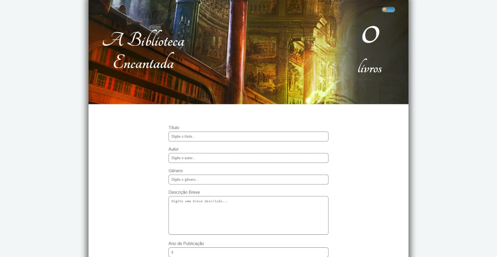

# The Magical Library

## 🤔 ABOUT 

At the moment (2024) I'm studying at [Growdev](https://www.growdev.com.br/) in their fullstack web developer course and I'm currently in the first React Module. In the challenge of this module, we were asked to create a React App to manage a magic book collection.

## 🚀 Features

- Add new books to the collection.
- Edit existing book information.
- Delete books that are no longer in the library.
- View all books in your collection.

### 📏 Rules:

- Add Book:
    - Fields: Id, Title, Author, Year of Publication, Date of
    registration, gender and a brief description.
    - All fields are mandatory.
    - There must be validation to ensure that the year of publication is not in the future.
- Edit Book:
    - The same fields as the addition form. It shouldn't be possible to edit registration date and ID
- Delete Book:
    - There must be confirmation before deleting a book to ensure that a book is not deleted by mistake.
- View Book:
    - There should be a list or grid showing all the books.
    - Each book must show the Title, Author and Year of Publication.
    - There should be an option to see more details, which will show all the information in the book.

### 🌟 Bonus:
- Search Functionality:
    - Implement a search functionality to find a specific book.

## 💻 Technologies used

- [React](https://react.dev)
- [Formik](https://formik.org)
- [CSS](https://developer.mozilla.org/pt-BR/docs/Web/CSS)

👾 Developed by [Jean Rafael Dresbach](https://www.linkedin.com/in/jean-dresbach-a98a90293/?locale=en_US).